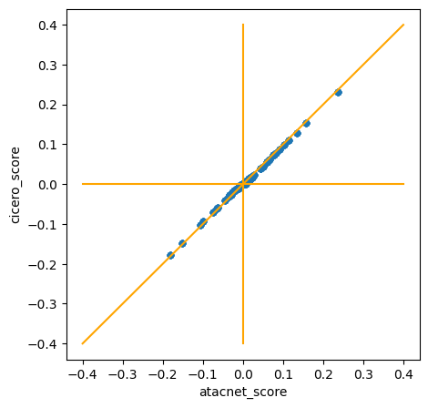

# AtacNet


## Description
This repo contains a python package for inferring co-accessibility networks from single-cell ATAC-seq data, using [skggm](https://www.github.com/skggm/skggm) for the graphical lasso and [scanpy](https://www.github.com/theislab/scanpy) for data processing.

It is based on the pipeline and hypotheses presented in the manuscript "Cicero Predicts cis-Regulatory DNA Interactions from Single-Cell Chromatin Accessibility Data" by Pliner et al. (2018). The original R package [Cicero](https://cole-trapnell-lab.github.io/cicero-release/) is available [here](https://www.github.com/cole-trapnell-lab/cicero-release).

Results may vary between both packages, notably due to the different implementations of graphical lasso. 
<br> Currently, scores seem proportional but absolute values differs slightly. (cf comparison plots below)


## Installation
The package can be installed using pip:

```
pip install "git+https://github.com/r-trimbour/atacnet.git"
```

 or by installing it from a local clone
```
git clone https://github.com/r-trimbour/atacnet.git
pip install "atacnet"
```

## Minimal example
```
import anndata as ad
import atacnet as an

atac = ad.read_h5ad('atac_data.h5ad')
an.add_region_infos(atac)
an.compute_atac_network(atac)
an.extract_atac_links(atac)
```

## Comparison to Cicero R package
### Toy dataset 1: 
<br> *On the same metacells obtained from Cicero code.*
- Pearson correlation coefficient: 0.99
- Pearson correlation coefficient: 0.98


### Coming:

_Add stats on similarity on large datasets._
<br>
_Add stats on runtime, memory usage._
<br>
_This package can be run on multiple cores._

## Usage
It is currently developped to work with AnnData objects. Check Example1.ipynb for a simple usage example.

