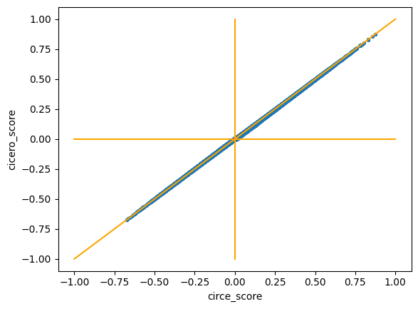

# ATACnet


## Description
This repo contains a python package for inferring **co-accessibility networks from single-cell ATAC-seq data**, using [skggm](https://www.github.com/skggm/skggm) for the graphical lasso and [scanpy](https://www.github.com/theislab/scanpy) for data processing.

It is based on the pipeline and hypotheses presented in the manuscript "Cicero Predicts cis-Regulatory DNA Interactions from Single-Cell Chromatin Accessibility Data" by Pliner et al. (2018). This R package [Cicero](https://cole-trapnell-lab.github.io/cicero-release/) is available [here](https://www.github.com/cole-trapnell-lab/cicero-release).

Results may slitghly vary between both packages, notably due to the different implementations of graphical lasso. 
<br> Currently, scores are very close when applied to the same metacells, computed from Cicero's methodology. (cf comparison plots below). It should run significantly faster than Cicero _(e.g.: running time of 5 sec instead of 17 min for the dataset 2)_.

_If you have any suggestion, don't hesitate ! This package is still a work in progress :)_


## Installation
The package can be installed using pip:

```
pip install atacnet
```

 and from github
```
pip install "git+https://github.com/r-trimbour/atacnet.git"
```

## Minimal example
```
import anndata as ad
import atacnet as an

atac = ad.read_h5ad('atac_data.h5ad')
an.add_region_infos(atac)
an.compute_atac_network(atac)
an.extract_atac_links(atac)
```

## Comparison to Cicero R package
<br> *On the same metacells obtained from Cicero code.*

All tests can be found in the [AtacNet benchmark repo](https://github.com/r-trimbour/atacnet_benchmark)

### Toy dataset 1 (fake data): 
- Pearson correlation coefficient: 0.998845
- Spearman correlation coefficient: 0.997321


### Real dataset 2 (subsample of neurips PBMC)
- Pearson correlation coefficient: 0.999733
- Spearman correlation coefficient: 0.999279


_Correlation is even higher if focusing only on high scores. Indeed, for both datasets, most of the variability is focused on the low scores, a.k.a. the less important ones._

### Coming:

- _**Calculate metacells !**_
- _Add stats on similarity on large datasets._
- _Add stats on runtime, memory usage._
- This package can be run on multiple cores. _Currently working to speed up the mutlithreding use._

## Usage
It is currently developped to work with AnnData objects. Check Example1.ipynb for a simple usage example.

